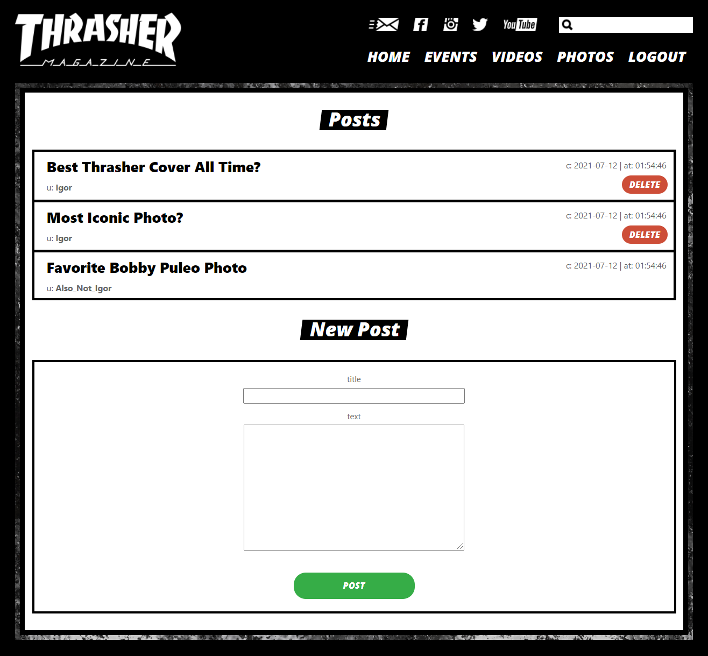

# Thrasher Forums

Skateboarding's number 1 magazine has decided to make a forum site. Skateboarders around the world will be able to sign up for an account, make posts and make comments. Topics include events, videos and photos.

Check it out [live](https://thrasher-forums.web.app/login).

---
## Technologies Used

### Frontend
React | JavaScript | CSS | HTML

### Backend
Ruby on Rails | PostgreSQL

---
## Installation & Local Server

### Backend: 
cd into the backend, run 'bundle install', 'rails db:create 'rails db:migrate', 'rails db:seed', and start the server with 'rails s'.

### Frontend:
cd into the frontend, run 'npm install' and 'npm start'.
Please use Chrome as your browser.

---
## Contributing
Bug reports and pull requests are welcome on GitHub at https://github.com/IgoVeyner/thrasher-forums. This project is intended to be a safe, welcoming space for collaboration, and contributors are expected to adhere to the code of conduct.

---
## License
The app is available as open source under the terms of the MIT License. https://opensource.org/licenses/MIT

---
## Code of Conduct
Everyone interacting in the project's codebases, issue trackers, chat rooms and mailing lists is expected to follow the code of conduct.
